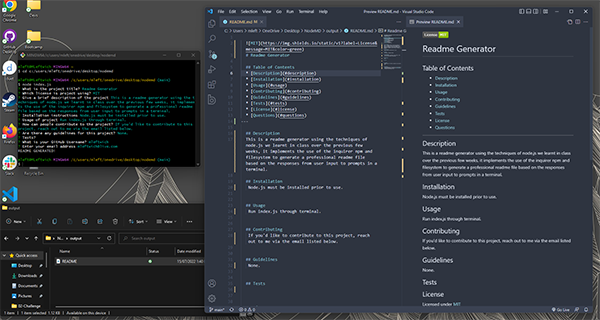

  
  # Readme Generator
  
  ## Table of Contents
  * [Description](#description)
  * [Installation](#installation)
  * [Usage](#usage)
  * [Contributing](#contributing)
  * [Guidelines](#guidelines)
  * [Tests](#tests)
  * [License](#license)
  * [Questions](#questions)
---

  ## Description
  This is a readme generator using the techniques of node.js we learnt in class over the previous few weeks, it implements the use of the inquirer npm and filesystem to generate a professional readme file based on the responses from user input to prompts in a terminal.

  This readme itself was generated using the app. You can find a demonstration of that process [Here](https://drive.google.com/file/d/141h7A1P8k3hPWwLa86HigRTpJ2MHGptO/view).

  

  ## Installation
   Node.js must be installed prior to use.

  ## Usage
   Run index.js through terminal.

  ## Contributing
   If you'd like to contribute to this project, reach out to me via the email listed below.

  ## Guidelines
   None.

  ## Tests
   

  ## License
   Licensed under [MIT](https://opensource.org/licenses/MIT) 

   ---

  ## Questions
   For any questions you can find me at [GitHub](https://github.com/mleftwich) or email me at [mleftwich@live.com](mailto:mleftwich@live.com) 
